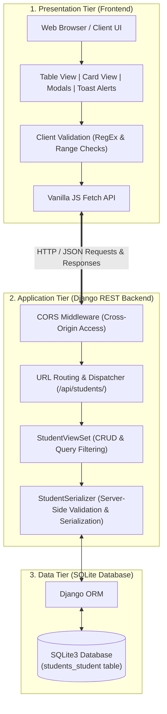
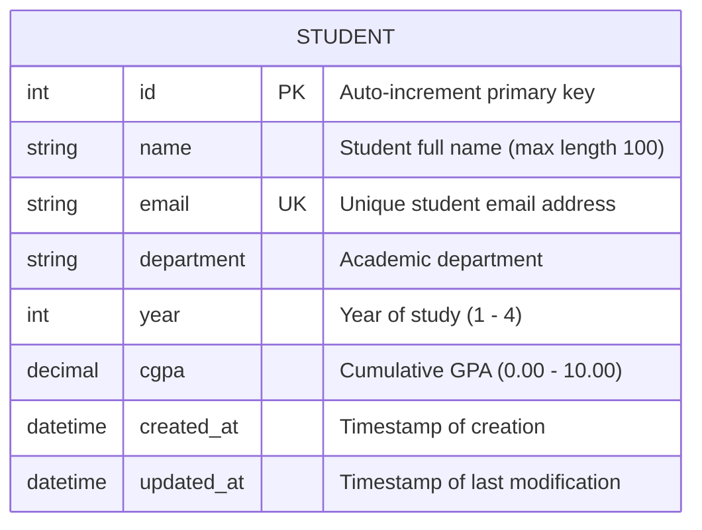

# Student Management System (Full-Stack CRUD Application)

A complete, beginner-friendly, deployment-ready full-stack **Student Management System** built to satisfy all requirements of the college project Standard Operating Procedure (SOP).

## 🚀 Live Demo

The deployed Student Management System is available here:

**Live Application:** https://student-management-crud-2-fimc.onrender.com/

You can open the link in a browser to access the deployed application.


---

## Table of Contents
1. [Project Overview](#1-project-overview)
2. [Problem Statement](#2-problem-statement)
3. [Objectives](#3-objectives)
4. [Technology Stack](#4-technology-stack)
5. [System Architecture](#5-system-architecture)
6. [Database Schema & ER Diagram](#6-database-schema--er-diagram)
7. [Project Folder Structure & File Explanations](#7-project-folder-structure--file-explanations)
8. [Installation & Execution Guide](#8-installation--execution-guide)
9. [REST API Endpoint Documentation](#9-rest-api-endpoint-documentation)
10. [CRUD Operations Workflow](#10-crud-operations-workflow)
11. [Form Validation Rules](#11-form-validation-rules)
12. [Automated Testing (`manage.py test`)](#12-automated-testing-managepy-test)
13. [Testing Every CRUD Operation in Postman](#13-testing-every-crud-operation-in-postman)
14. [How to Upload Project to GitHub](#14-how-to-upload-project-to-github)
15. [Challenges & Solutions](#15-challenges--solutions)
16. [Future Enhancements](#16-future-enhancements)

---

## 1. Project Overview

The **Student Management System** provides academic institutions with a centralized, responsive web platform to manage student academic records. It allows staff and administrators to seamlessly **Create**, **Read**, **Update**, and **Delete** (CRUD) student profiles with real-time client-side and server-side validation, live search, department/year filtering, and statistical aggregations.

The backend is powered by **Python Django** and **Django REST Framework (DRF)** using an **SQLite** database, while the frontend is constructed using pure **HTML5**, **CSS3**, and **Vanilla JavaScript** (Fetch API), following clean architectural principles.

---

## 2. Problem Statement

Educational institutions often face operational inefficiencies when managing student records across fragmented spreadsheets and paper documents. Issues include:
- Inconsistent data formatting and lack of strict data validation.
- Duplicate student records and conflicting contact information.
- Inability to quickly search, filter, or retrieve individual student profiles.
- Lack of standardized, reusable REST APIs for cross-platform integration.

This project addresses these challenges by delivering a validated, responsive, and API-driven application.

---

## 3. Objectives

- **Develop a Responsive User Interface**: Build an intuitive UI with dashboard metrics, data tables, and card views using HTML5 and CSS3.
- **Implement RESTful Backend APIs**: Expose clean endpoints (`GET`, `POST`, `PUT`, `PATCH`, `DELETE`) with standard HTTP status codes (`200`, `201`, `204`, `400`, `404`).
- **Enforce Two-Tier Validation**: Validate user inputs on the frontend (instant user feedback) and on the backend (data integrity).
- **Persistent Relational Storage**: Model student data using Django ORM backed by an SQLite database.
- **Support Advanced Querying**: Implement debounced keyword search across names, emails, and departments, plus filtering by department and year.
- **Comprehensive Testing**: Provide automated Django unit tests and an importable Postman collection.

---

## 4. Technology Stack

| Layer | Technology | Version | Purpose |
| :--- | :--- | :--- | :--- |
| **Frontend UI** | HTML5, CSS3, Vanilla JS | ES6+ | Responsive layout, DOM manipulation, client-side validation |
| **Icons & Typography** | FontAwesome, Inter | 6.4.0 / WebFont | Visual icons and modern typography |
| **Backend Framework** | Python Django | 5.1.x | Server-side logic, ORM, routing, and template serving |
| **REST API Engine** | Django REST Framework (DRF) | 3.15.x | Serializers, ModelViewSet, and JSON responses |
| **CORS Middleware** | `django-cors-headers` | 4.4.x | Cross-Origin Resource Sharing handling |
| **Database** | SQLite3 | 3.x | Lightweight, relational zero-configuration database |
| **API Testing** | Postman | v2.1 | Automated and manual REST API test suites |
| **Version Control** | Git & GitHub | Latest | Source code management and repository tracking |

---

## 5. System Architecture

The application follows a decoupled, three-tier full-stack architecture:



---

## 6. Database Schema & ER Diagram

The student entity is defined by the following schema:



### Table Column Details:
- **`id`** (`INTEGER`, Primary Key, Auto-increment): Unique identifier for each student.
- **`name`** (`VARCHAR(100)`, Not Null): Student's full name.
- **`email`** (`VARCHAR(254)`, Unique, Not Null): Student's email with unique database index.
- **`department`** (`VARCHAR(100)`, Not Null): Department (e.g. Computer Science, Information Technology, etc.).
- **`year`** (`INTEGER`, Not Null): Value between `1` and `4`.
- **`cgpa`** (`DECIMAL(4, 2)`, Not Null): Value between `0.00` and `10.00`.
- **`created_at`** (`DATETIME`, Not Null): Set automatically upon creation (`auto_now_add=True`).
- **`updated_at`** (`DATETIME`, Not Null): Updated automatically on every save (`auto_now=True`).

---

## 7. Project Folder Structure & File Explanations

```
Student-Management-CRUD/
├── .gitignore                                      # Ignores venv, db.sqlite3, cache, and IDE files
├── README.md                                       # Comprehensive college project documentation
├── backend/                                        # Django backend project directory
│   ├── manage.py                                   # Django administrative CLI script
│   ├── requirements.txt                            # Python project dependencies
│   ├── student_management/                         # Project configuration package
│   │   ├── __init__.py                             # Package marker
│   │   ├── settings.py                             # Django settings (DB, Apps, CORS, Static)
│   │   ├── urls.py                                 # Root URL configuration and frontend routing
│   │   ├── asgi.py                                 # ASGI entry point for async servers
│   │   └── wsgi.py                                 # WSGI entry point for web servers
│   └── students/                                   # Student CRUD application package
│       ├── __init__.py                             # App package marker
│       ├── admin.py                                # Django admin panel customization
│       ├── apps.py                                 # App configuration metadata
│       ├── models.py                               # Student database model and field constraints
│       ├── serializers.py                          # DRF serializer with strict server-side validation
│       ├── views.py                                # StudentViewSet implementing full CRUD + search/filter
│       ├── urls.py                                 # REST API route mappings via DefaultRouter
│       ├── tests.py                                # 21 automated unit and integration tests
│       └── migrations/                             # Database migration scripts
│           ├── 0001_initial.py                     # Initial migration creating Student table
│           └── __init__.py
├── frontend/                                       # Decoupled frontend directory
│   ├── index.html                                  # Semantic single-page application dashboard
│   ├── css/
│   │   └── style.css                               # Responsive styles, grid/flex layouts, animations
│   └── js/
│       └── app.js                                  # Fetch API, state management, validation, modals
└── postman/                                        # API testing resources
    ├── Student_Management_API.postman_collection.json  # Complete exportable Postman collection
    └── POSTMAN_GUIDE.md                            # Step-by-step Postman testing instructions
```

### Detailed File Explanations:
1. **`backend/manage.py`**: The entry point for executing Django commands such as `runserver`, `makemigrations`, `migrate`, and `test`.
2. **`backend/student_management/settings.py`**: Defines core configurations including database (SQLite), registered apps (`rest_framework`, `corsheaders`, `students`), middleware pipeline, and static files.
3. **`backend/student_management/urls.py`**: Directs `/api/` traffic to `students.urls` and maps `/` to serve the frontend single-page dashboard.
4. **`backend/students/models.py`**: Defines the `Student` model with field types, boundary validators (`MinValueValidator`, `MaxValueValidator`), and meta ordering.
5. **`backend/students/serializers.py`**: Serializes student records to/from JSON; includes custom validation logic for names, emails, academic year ranges, and CGPA limits.
6. **`backend/students/views.py`**: Implements the `StudentViewSet` offering standard actions (`create`, `list`, `retrieve`, `update`, `partial_update`, `destroy`) and a custom `stats` action.
7. **`backend/students/urls.py`**: Automatically constructs RESTful endpoints using Django REST Framework's `DefaultRouter`.
8. **`backend/students/tests.py`**: Unit and integration test suite asserting CRUD operations, search, filters, validation failures, and stats endpoints.
9. **`frontend/index.html`**: HTML5 user interface featuring statistic cards, search/filter controls, data tables, card grids, and accessible dialogs.
10. **`frontend/css/style.css`**: CSS3 stylesheet implementing CSS variables, responsive media queries, card transitions, and toast alerts.
11. **`frontend/js/app.js`**: JavaScript client managing state, network requests via `fetch()`, client-side regex validations, search debouncing, and UI updates.
12. **`postman/Student_Management_API.postman_collection.json`**: Pre-configured JSON collection importable directly into Postman.

---

## 8. Installation & Execution Guide

Follow these steps to set up and run the project locally on Windows, macOS, or Linux.

### Prerequisites
- **Python 3.10+** (Python 3.12 recommended)
- **Git**

---

### Step 1: Open Terminal in Project Directory
Navigate to the project root:
```bash
cd Student-Management-CRUD
```

---

### Step 2: Create and Activate Virtual Environment
```powershell
# Windows (PowerShell)
python -m venv venv
.\venv\Scripts\Activate.ps1

# Windows (Command Prompt)
venv\Scripts\activate.bat

# macOS / Linux
python3 -m venv venv
source venv/bin/activate
```

---

### Step 3: Install Required Dependencies
Install the required packages listed in `backend/requirements.txt`:
```powershell
pip install -r backend/requirements.txt
```

---

### Step 4: Apply Database Migrations
Create the SQLite database tables:
```powershell
python backend/manage.py migrate
```

---

### Step 5: (Optional) Seed Sample Records
To populate the database with initial test students:
```powershell
python -c "
import os, django, sys
os.environ.setdefault('DJANGO_SETTINGS_MODULE', 'student_management.settings')
sys.path.append('backend')
django.setup()
from students.models import Student
students = [
    {'name': 'Aarav Sharma', 'email': 'aarav.sharma@college.edu', 'department': 'Computer Science', 'year': 3, 'cgpa': 9.15},
    {'name': 'Priya Patel', 'email': 'priya.patel@college.edu', 'department': 'Information Technology', 'year': 4, 'cgpa': 9.40},
    {'name': 'Rohan Verma', 'email': 'rohan.verma@college.edu', 'department': 'Electronics & Communication', 'year': 2, 'cgpa': 8.25},
    {'name': 'Ananya Sen', 'email': 'ananya.sen@college.edu', 'department': 'Data Science & AI', 'year': 1, 'cgpa': 8.85},
    {'name': 'Vikram Rao', 'email': 'vikram.rao@college.edu', 'department': 'Mechanical Engineering', 'year': 3, 'cgpa': 7.90}
]
for s in students: Student.objects.get_or_create(email=s['email'], defaults=s)
print('Database seeded with 5 sample students!')
"
```

---

### Step 6: Start the Django Development Server
```powershell
python backend/manage.py runserver 127.0.0.1:8000
```

---

### Step 7: Access the Application
Open your web browser and navigate to:
- **Web Application Dashboard**: [http://127.0.0.1:8000/](http://127.0.0.1:8000/)
- **Browsable REST API**: [http://127.0.0.1:8000/api/students/](http://127.0.0.1:8000/api/students/)
- **API Statistics Endpoint**: [http://127.0.0.1:8000/api/students/stats/](http://127.0.0.1:8000/api/students/stats/)

*(Note: You can also open `frontend/index.html` directly in any browser or with VS Code Live Server because CORS is enabled on the backend).*

---

## 9. REST API Endpoint Documentation

| HTTP Method | Endpoint | Purpose | Request Body (JSON) | Success Status | Error Status |
| :--- | :--- | :--- | :--- | :--- | :--- |
| **`GET`** | `/api/students/` | List all students (supports search & filter) | None | `200 OK` | `500 Server Error` |
| **`POST`** | `/api/students/` | Create a new student record | `{ name, email, department, year, cgpa }` | `201 Created` | `400 Bad Request` |
| **`GET`** | `/api/students/{id}/` | Retrieve single student by ID | None | `200 OK` | `404 Not Found` |
| **`PUT`** | `/api/students/{id}/` | Full update of student details | `{ name, email, department, year, cgpa }` | `200 OK` | `400 / 404` |
| **`PATCH`** | `/api/students/{id}/` | Partial update of specific fields | Any subset of student fields | `200 OK` | `400 / 404` |
| **`DELETE`** | `/api/students/{id}/` | Permanently remove student | None | `200 OK` | `404 Not Found` |
| **`GET`** | `/api/students/stats/`| Aggregated metrics (total, avg CGPA, dept breakdown) | None | `200 OK` | `500 Server Error` |

### Query Parameters for `GET /api/students/`:
- **`?search=<keyword>`**: Case-insensitive substring match across `name`, `email`, and `department`.
- **`?department=<dept>`**: Filter records by exact department name.
- **`?year=<year>`**: Filter records by academic year (`1`, `2`, `3`, or `4`).
- **`?ordering=<field>`**: Sort results by `name`, `-name`, `cgpa`, `-cgpa`, `year`, `-year`, `id`, or `-id`.

---

## 10. CRUD Operations Workflow

```
+-----------------------------------------------------------------------------------+
|                                 CRUD WORKFLOW                                     |
+-------------------+--------------------+--------------------+---------------------+
| OPERATION         | USER ACTION        | BACKEND ACTION     | UI FEEDBACK         |
+-------------------+--------------------+--------------------+---------------------+
| 1. CREATE         | Fill form and click| POST JSON payload, | Modal closes, toast |
|                   | "Add Student"      | validate & persist | alert, table reload |
+-------------------+--------------------+--------------------+---------------------+
| 2. READ           | Open dashboard or  | GET query from DB, | Table / Cards       |
|                   | apply search/filter| return JSON list   | render dynamically  |
+-------------------+--------------------+--------------------+---------------------+
| 3. UPDATE         | Edit fields in     | PUT/PATCH request, | Updated values      |
|                   | modal & save       | re-validate & save | reflected in table  |
+-------------------+--------------------+--------------------+---------------------+
| 4. DELETE         | Confirm delete in  | DELETE record from | Record removed,     |
|                   | dialog             | SQLite database    | count recalculated  |
+-------------------+--------------------+--------------------+---------------------+
```

---

## 11. Form Validation Rules

Both **Client-Side** (JavaScript) and **Server-Side** (Django Serializers & Models) enforce the following rules:

1. **Student Name**:
   - Mandatory field (cannot be blank or whitespace only).
   - Minimum length: 2 characters; Maximum length: 100 characters.
   - Allowed characters: Letters, spaces, dots, hyphens (`^[A-Za-z\s\.\-']+$`).
2. **Email Address**:
   - Mandatory field.
   - Must conform to standard email syntax (`^[a-zA-Z0-9_.+-]+@[a-zA-Z0-9-]+\.[a-zA-Z0-9-.]+$`).
   - Must be **globally unique** in the database.
3. **Department**:
   - Mandatory selection from standardized departments (Computer Science, Information Technology, etc.).
4. **Year of Study**:
   - Mandatory integer.
   - Must be within the range **1 to 4**.
5. **CGPA**:
   - Mandatory numeric decimal.
   - Must be within the range **0.00 to 10.00**.

---

## 12. Automated Testing (`manage.py test`)

The project includes an automated test suite with **21 tests** covering model validations, serializer errors, full CRUD operations, edge cases, search, and filtering.

To run the test suite:
```powershell
python backend/manage.py test students
```

### Expected Output:
```text
Creating test database for alias 'default'...
Found 21 test(s).
System check identified no issues (0 silenced).
.....................
----------------------------------------------------------------------
Ran 21 tests in 0.098s

OK
Destroying test database for alias 'default'...
```

---

## 13. Testing Every CRUD Operation in Postman

A pre-built Postman collection is included in the project:
`postman/Student_Management_API.postman_collection.json`

### Import into Postman:
1. Open **Postman**.
2. Click **Import** (top left).
3. Select `postman/Student_Management_API.postman_collection.json`.
4. Run the requests sequentially.

### Manual Postman Testing Details:

#### 1. Create Student (POST)
- **Method**: `POST`
- **URL**: `http://127.0.0.1:8000/api/students/`
- **Headers**: `Content-Type: application/json`
- **Body**:
  ```json
  {
    "name": "Kavya Krishnan",
    "email": "kavya.krishnan@college.edu",
    "department": "Computer Science",
    "year": 3,
    "cgpa": 9.25
  }
  ```
- **Expected Status**: `201 Created`

#### 2. Read All Students (GET)
- **Method**: `GET`
- **URL**: `http://127.0.0.1:8000/api/students/`
- **Expected Status**: `200 OK`

#### 3. Search Students by Keyword (GET)
- **Method**: `GET`
- **URL**: `http://127.0.0.1:8000/api/students/?search=Kavya`
- **Expected Status**: `200 OK`

#### 4. Filter Students by Department & Year (GET)
- **Method**: `GET`
- **URL**: `http://127.0.0.1:8000/api/students/?department=Computer%20Science&year=3`
- **Expected Status**: `200 OK`

#### 5. Read Individual Student by ID (GET)
- **Method**: `GET`
- **URL**: `http://127.0.0.1:8000/api/students/1/`
- **Expected Status**: `200 OK`

#### 6. Full Update Student (PUT)
- **Method**: `PUT`
- **URL**: `http://127.0.0.1:8000/api/students/1/`
- **Headers**: `Content-Type: application/json`
- **Body**:
  ```json
  {
    "name": "Kavya Krishnan",
    "email": "kavya.krishnan@college.edu",
    "department": "Computer Science",
    "year": 4,
    "cgpa": 9.75
  }
  ```
- **Expected Status**: `200 OK`

#### 7. Partial Update Student (PATCH)
- **Method**: `PATCH`
- **URL**: `http://127.0.0.1:8000/api/students/1/`
- **Headers**: `Content-Type: application/json`
- **Body**:
  ```json
  {
    "cgpa": 9.90
  }
  ```
- **Expected Status**: `200 OK`

#### 8. Delete Student (DELETE)
- **Method**: `DELETE`
- **URL**: `http://127.0.0.1:8000/api/students/1/`
- **Expected Status**: `200 OK`

#### 9. Test Negative Case: Duplicate Email (POST)
- Send POST request with an email that already exists in the database.
- **Expected Status**: `400 Bad Request` with message: `"Student with this email already exists."`

*(See [`postman/POSTMAN_GUIDE.md`](postman/POSTMAN_GUIDE.md) for full instructions and screenshots).*

---

## 14. How to Upload Project to GitHub

Follow these exact steps to upload this project to your GitHub account:

### Step 1: Initialize Git Repository
Make sure you are in the root directory:
```powershell
cd Student-Management-CRUD
git init
```

### Step 2: Check Git Status and Stage Files
Verify that `.gitignore` correctly prevents `venv` and temporary cache files from being tracked:
```powershell
git status
git add .
```

### Step 3: Create Initial Commit
```powershell
git commit -m "feat: complete student management CRUD web application satisfying college SOP requirements"
```

### Step 4: Create a New Repository on GitHub
1. Log into your account at [https://github.com](https://github.com).
2. Click the **`+`** icon in the top-right corner and select **New repository**.
3. Name your repository (e.g. `Student-Management-CRUD`).
4. Keep the repository **Public** (or Private).
5. **Do NOT** check "Add a README file", ".gitignore", or "license" (we already created them locally).
6. Click **Create repository**.

### Step 5: Link Local Repository to GitHub and Push
Copy your repository URL from GitHub and execute:
```powershell
# Rename main branch to 'main'
git branch -M main

# Link remote origin (replace with your actual GitHub username and repository name)
git remote add origin https://github.com/<YOUR_GITHUB_USERNAME>/Student-Management-CRUD.git

# Push code to GitHub
git push -u origin main
```

---

## 15. Challenges & Solutions

| Challenge | Root Cause | Solution Implemented |
| :--- | :--- | :--- |
| **Cross-Origin Resource Sharing (CORS)** | Decoupled frontend running on a different port or file protocol blocked by browser security | Integrated `django-cors-headers` middleware configured with `CORS_ALLOW_ALL_ORIGINS = True` |
| **Input Validation Synchronization** | Discrepancies between client UI validation and database constraints | Implemented double-layered validation: Regex + range checks in `app.js` and strict model validators in `serializers.py` |
| **Duplicate Email Handling** | Multiple students attempting to register with the same email address | Configured `unique=True` on `models.EmailField` and added custom `validate_email` in serializer with friendly error feedback |
| **Frontend Network Failure Handling** | Frontend breaking silently when the Django backend server is stopped | Created dynamic health monitoring in `app.js` that displays an emergency retry banner at the top of the UI |

---

## 16. Future Enhancements

- **User Authentication & Roles**: Implement JWT authentication to restrict student deletion to faculty/administrators.
- **Export to CSV / PDF**: Allow administrators to export filtered student lists to spreadsheet or PDF format.
- **Student Profile Picture Upload**: Support multipart avatar image uploads stored via Django Media storage.
- **Pagination**: Add DRF `PageNumberPagination` for handling datasets with thousands of students.

---

## License & Author
- **Project**: College CRUD-Based Web Application Development
- **Status**: Completed & Verified
